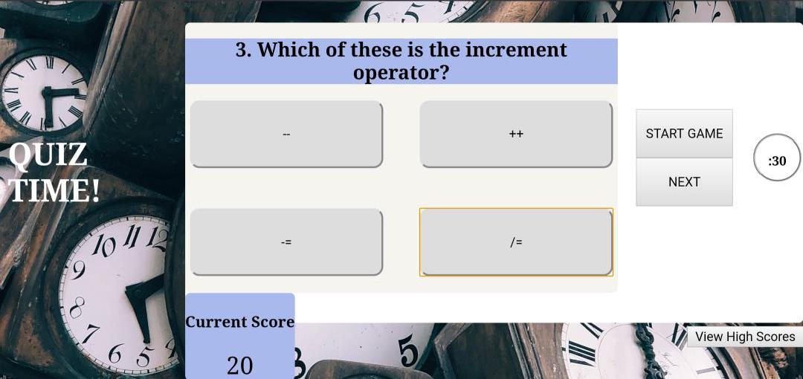

# QUIZTime 
### the knowledge assessment API! 

## Description
QuizTime is  a basic application that takes the user through a set of 7 multiple choice questions, with buttons for selection. This quiz has a countdown timer of 60 seconds and a scorekeeper to give the user feedback on the validity of their choices. 

## Purpose
This application is purposed to be a simple educational assessment tool, accssible from a desktop or mobile device. With it's score and time features, it can qualify user attempts and determine the most knowledgable individual on the given questions.

## Built With 
HTML, CSS, JavaScript

## Snapshots of Application 

## Website 
https://twalker7.github.io/04-QuizTime/

## Contribution 
I built all aspects of this application from scratch, initially watching online tutorials to give me ideas, but realizing that I could create a simpler application on my own when it came down to the specific implementation. My biggest divergence from conventional approaches is in how I chose to validate correct answers. I allowed each button to contain its own knowledge of when it was the "valid click" based on the current index of the quiz question array. Due to this divergence from the techniques that developers typically implement for such a program, this code might have challenges with scalability. Code written by Thomas Walker. 